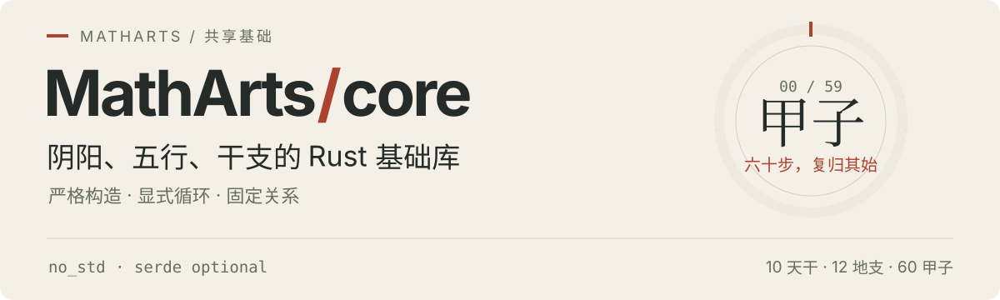

<picture>
  <source media="(max-width: 600px)" srcset="assets/readme/hero-mobile.svg" />
  
</picture>

# MathArts Core

为数术项目提供共用的 Rust 领域值与固定关系：阴阳、五行、干支、旬、纳音，以及三爻与六爻结构。

**`no_std` · 禁止 `unsafe` · 默认无生产依赖 · 可选 `serde` · Rust 2024**

Core 负责合法值、周期步进和固定对应；历法日期、排盘、起卦与流派策略由上层领域库处理。规则查询的适用范围见[规则边界](#规则边界)。

[快速开始](#快速开始) · [当前能力](#当前能力) · [接口约定](#接口约定) · [规则边界](#规则边界) · [开发验证](#开发验证) · [文档](#文档)

## 快速开始

### 运行仓库示例

已安装 [mise](https://mise.jdx.dev/) 时，克隆仓库并使用项目固定的工具链运行：

```sh
git clone https://github.com/matharts/core.git
cd core
mise install
mise exec -- cargo run --example ganzhi --locked
```

[examples/ganzhi.rs](examples/ganzhi.rs) 展示中文解析、阴阳五行、关系查询、周期步进、旬与纳音，并验证非法输入的错误分类。库保持 `no_std`，示例由宿主程序输出结果。

### 接入应用

应用的 Rust 最低版本为 **1.99**，以 [Cargo.toml](Cargo.toml) 的 `rust-version` 为准。将应用和已克隆的 `core` 仓库放在同一父目录，在应用的 `Cargo.toml` 中添加：

```toml
[dependencies]
matharts_core = { path = "../core" }
```

将下面的完整示例保存为应用的 `src/main.rs`，在应用目录运行 `cargo run`：

```rust
use matharts_core::{Branch, CyclicRing, ParseError, SexagenaryCycle};

fn main() -> Result<(), ParseError> {
    let value: SexagenaryCycle = "甲子".parse()?;

    println!("{value} → {}", value.offset(1)); // 甲子 → 乙丑
    assert_eq!(value.offset(60), value);
    assert_eq!(value.xun().void_branches(), (Branch::Xu, Branch::Hai));
    assert_eq!(value.nayin().name(), "海中金");
    assert!("甲丑".parse::<SexagenaryCycle>().is_err());
    Ok(())
}
```

构造、中文解析和反序列化都会校验天干与地支的阴阳配对，因此“甲丑”会被拒绝。

需要序列化时，在同一依赖上启用 `serde`：

```toml
matharts_core = { path = "../core", features = ["serde"] }
```

默认特性为空，`serde` 是唯一可选生产特性，启用后仍支持 `no_std`。数据格式见 [Serde 编码](#serde-编码)。

## 当前能力

| 领域 | 操作与查询 |
| --- | --- |
| 阴阳、五行 | 阴阳反转、五行生克与关系查询 |
| 干支 | 严格构造、周期步进、中文解析与显示 |
| 旬、纳音 | 身份、成员、旬内缺位地支与纳音五行 |
| 固定关系组 | 五合、六合、六冲、六害、采用表六破、三合与三会；归属、成员与完整集合识别 |
| 具名规则 | 十神、长生、藏干及刑的采用表查询 |
| 干推导 | `derive_month_stem`、`derive_hour_stem` 推导月干、时干 |
| 爻卦结构 | 三爻、六爻构造，指定爻操作、阴阳反转与爻序倒置 |

公共类型可从 crate 根导入，入口见 [src/lib.rs](src/lib.rs)；完整签名与采用规则见[本地生成的 rustdoc](#开发验证)。

`Xun` 表示六十甲子的六旬，`Nayin` 表示三十类纳音身份。两者支持严格索引构造；`Nayin` 的索引只表示身份编号，不提供周期操作。

### 关系查询

查询单个成员的归属，或用完整输入识别关系组：

```rust
use matharts_core::{Branch, Element, FiveCombination, Stem, ThreeCombination};

let five = Stem::Jia.five_combination();
assert_eq!(five, FiveCombination::JiaJi);
assert_eq!(five.partner_of(Stem::Jia), Some(Stem::Ji));
assert_eq!(five.partner_of(Stem::Yi), None);
assert_eq!(five.element(), Element::Earth);

let three = Branch::Shen.three_combination();
assert_eq!(three.members(), [Branch::Zi, Branch::Chen, Branch::Shen]);
assert_eq!(
    ThreeCombination::from_branches([Branch::Shen, Branch::Chen, Branch::Zi]),
    Some(three),
);
assert_eq!(ThreeCombination::from_branches([Branch::Zi; 3]), None);
```

只需另一成员时，可直接调用 `Stem::five_combination_partner()`、`Branch::six_combination_partner()` 等方法。

成员数组按领域索引升序；完整集合识别忽略输入排列，拒绝重复与混组。调用方需保留三传等有业务含义的顺序。同一输入可同时具有多种关系，六合仅提供配对身份与成员查询。

### 爻卦结构

六爻构造参数为下卦在前、上卦在后；爻数组从下到上，最低位代表初爻，阳为 `1`、阴为 `0`：

```rust
use matharts_core::{Hexagram, HexagramPosition, Trigram};

let tai = Hexagram::from_trigrams(Trigram::Qian, Trigram::Kun);
assert_eq!(tai.bits(), 7);
assert_eq!(tai.reverse_lines().bits(), 56);

let qian = Hexagram::from_trigrams(Trigram::Qian, Trigram::Qian);
let gou = qian.toggle_line(HexagramPosition::First);
assert_eq!((gou.lower(), gou.upper()), (Trigram::Xun, Trigram::Qian));
```

`complement()` 逐爻反转阴阳，`reverse_lines()` 倒置完整爻序；`try_from_bits()` 拒绝越界编码，爻位不周期回绕。结构编码与传统卦序分开，六十四卦名称、文王序、动爻选择和占断规则由上层处理。

## 接口约定

- **索引与周期**：`TryFrom<u8>` 严格拒绝越界值；`CyclicRing::from_index()` 按周期回绕，`offset()` 支持全部 `i32` 正负位移。
- **中文文本**：`Primitive`、`Element`、`Stem`、`Branch`、`SexagenaryCycle`、`Trigram`、`Xun`、`Nayin` 的 `FromStr` 仅接受精确名称，`Display` 输出相同中文。旬名包含“旬”字（如“甲子旬”），纳音使用采用表中的用字；不裁剪空白或接受别名。
- **整数步进**：`Stem`、`Branch`、`Growth`、`SexagenaryCycle`、`Xun` 支持 `+ i32`、`- i32`、`+= i32`、`-= i32`，包括 `i32::MIN/MAX`。值间的正向距离使用 `from.distance_to(to)`。
- **解析错误**：`ParseError` 区分名称错误、干支格式错误与非法配对；它是 `non_exhaustive` 枚举，外部匹配需保留兜底分支。
- **关系方向**：十神、生克、刑与循环距离保留参数方向。

中文解析不分配堆内存。`Display` 可写入 `core::fmt::Write`；调用 `to_string()` 的分配发生在应用侧。

### Serde 编码

中文显示与机器编码分开维护。可读格式使用固定代码字符串和具名对象，例如 `SexagenaryCycle`：

```json
{ "stem": "Jia", "branch": "Zi" }
```

可读枚举仅接受代码字符串；可读记录仅接受具名对象，拒绝未知、重复和缺失字段，干支仍需通过阴阳配对校验。

<details>
<summary>记录字段与紧凑格式</summary>

| 记录 | 必需字段 |
| --- | --- |
| `SexagenaryCycle` | `stem`、`branch` |
| `HiddenStems` | `primary`、`secondary`、`tertiary`；空槽显式为 `null` |
| `Hexagram` | `lower`、`upper`，例如 `{"lower":"Qian","upper":"Kun"}` |

`HiddenStems` 是可自定义的记录容器，允许重复成员和第三槽独立存在。紧凑格式使用原生 unit variant／struct 模型，不承诺任意第三方格式的字节兼容。独立编码样本维护在 [tests/fixtures/](tests/fixtures/)，编码、解码和非法输入分别验证。

</details>

## 规则边界

使用这些类型与查询时，区分值身份、固定对应和应用条件：

- **值与结构**：表示阴阳、五行、干支及爻卦结构；不从日期推导历法归属。
- **固定对应**：返回所采用表中的关系、阶段或成员；来源与适用范围随类型或方法的 rustdoc 维护。
- **应用条件**：实际成局、成化、空亡效应及吉凶由调用方判断；节气、换日、排盘、起卦和流派策略由上层领域库实现。

十神、长生、藏干及刑合等采用表的跨体系适用性需逐项核验。天干冲、五合、六合、三合、三会、长生和十神的 rustdoc 记录采用版本、消费场景、同输入对照及已知差异，未完成的校勘或消费方证据标记为待补。六破采用《六壬大全》表，跨体系复用证据待补。

藏干、五虎遁和五鼠遁的来源定位、转录差异及调用前提分别见 `Branch::hidden_stems`、`derive_month_stem` 和 `derive_hour_stem` 的 rustdoc。未明确的底本版本、影印校勘和跨体系消费对照分别标记为待补。

固定表测试验证实现与采用表的一致性；它不能替代文献校勘或跨体系消费验证。真实消费证据应记录消费方及版本、输入含义与调用前提、同输入输出及已知差异；仓内示例不算作外部体系已经接入的证明。

## 开发验证

[rust-toolchain.toml](rust-toolchain.toml) 固定 Rust `1.99.0`，与 [mise.toml](mise.toml) 和 CI 保持一致。在 Core 仓库安装工具链、Git hooks，并执行本地检查：

```sh
mise install
mise exec -- rustup component add rustfmt clippy
mise exec -- hk install --mise
mise exec -- hk check --all --slow
```

[hk.pkl](hk.pkl) 配置格式、严格 Clippy 及 Serde 关闭／开启两组 debug 测试；不带 `--slow` 时只检查格式与 Clippy。提交前检查暂存的 Rust 改动，推送前运行测试，纯文档改动跳过。

完整的 release 特性矩阵、裸机 `no_std` 构建、示例运行和严格文档检查见 [CI 工作流](.github/workflows/ci.yml)，按改动选择检查的要求见 [AGENTS.md](AGENTS.md)。

生成并打开公共接口文档：

```sh
mise exec -- cargo doc --no-deps --all-features --locked --open
```

## 文档

| 查阅内容 | 入口 |
| --- | --- |
| 接入与公共接口 | 本 README、[src/lib.rs](src/lib.rs) 与生成的 rustdoc |
| 统一领域术语 | [CONTEXT.md](CONTEXT.md) |
| 结构、规则来源与编码契约 | 所属类型的 rustdoc、源码与 [tests/](tests/)；独立样本见 [tests/fixtures/](tests/fixtures/) |
| 项目职责与开发要求 | [AGENTS.md](AGENTS.md) |
| 任务管理 | [GitHub Issues](https://github.com/matharts/core/issues)、[Issue 操作](docs/agents/issue-tracker.md)、[分诊标签](docs/agents/triage-labels.md) |
| 领域文档维护 | [领域文档规则](docs/agents/domain.md) |

## 许可证

[MIT](LICENSE)
